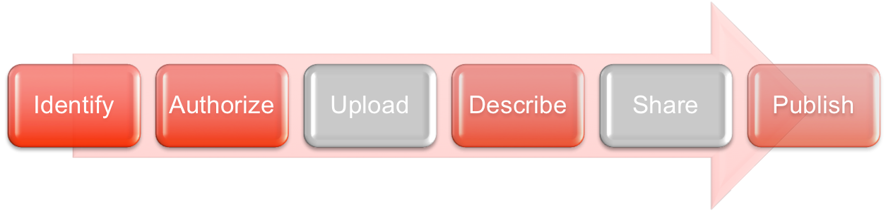
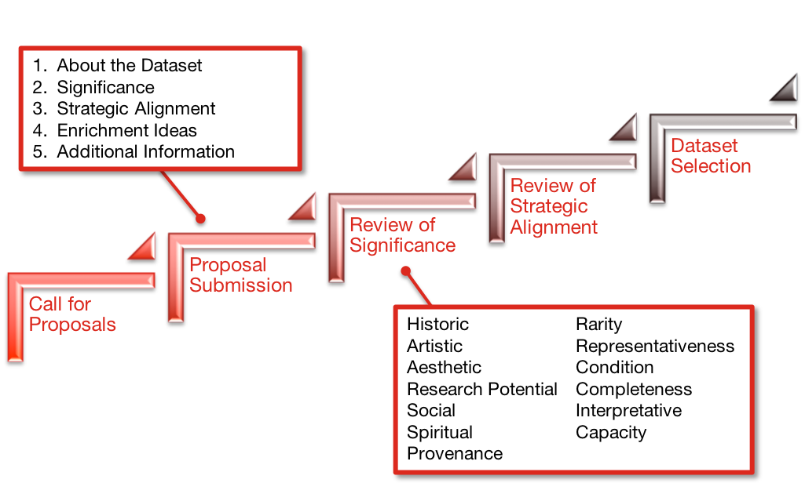
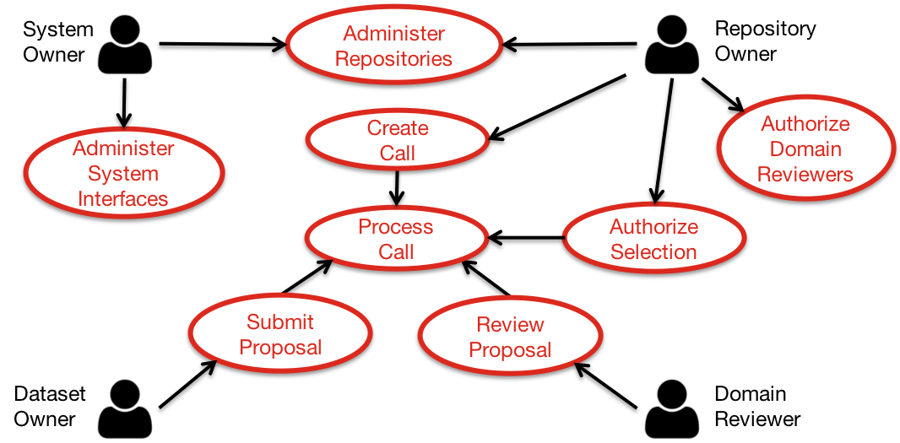

Dareon is designed to help the administrators of research data 
repositories. More specifically, this web application is aimed at 
repositories that are open to submissions from a target group of 
researchers, which may be for a domain, institution, etc.

### Data Sharing

The sharing of research data requires a process that reviews the 
datasets to determine whether they are appropriate for publication 
and further enrichment: 

This process can be length and onerous for a repository owners.

Dareon aims to reduce this burden by managing the first two steps of the
process: 
   - **Identify**: Dareon allows owners to create and manage multiple
	*Calls for Proposals* for their repositories.
	
   - **Authorize**: Dareon links reviewers with proposals, and supports the 
	ranking and selection of proposals.

### Data Review Process

Dareon is designed to help Repository Owners, Dataset Owners, and 
Proposal Reviewers collaborate through the review process. 

Some steps of this process include:

#### Call for Proposals (CfP)
A Repository Owner creates a call for new submission to their repository.

#### Proposal Submission
Dataset Owners submit a proposal against a CfP for the dataset to be 
included in a repository.

#### Review of Significance
The submission is reviewed to identify whether the dataset is 
significant within its research domain.

#### Review of Strategic Alignment
The submission is reviewed to identifyhow much the dataset is aligned 
with the goals of the repository.

#### Dataset Selection
Datasets are selected by the Repository Owner based on a ranking of 
Significance and Strategic Alignment.
Dareon does not store any Datasets as part of this process. Each 
submission should provide a link to the data, when required by the CfP, 
that is accessible to the Reviewers.

### Functional Design

The following diagram shows an overview of Dareon's functional design:

